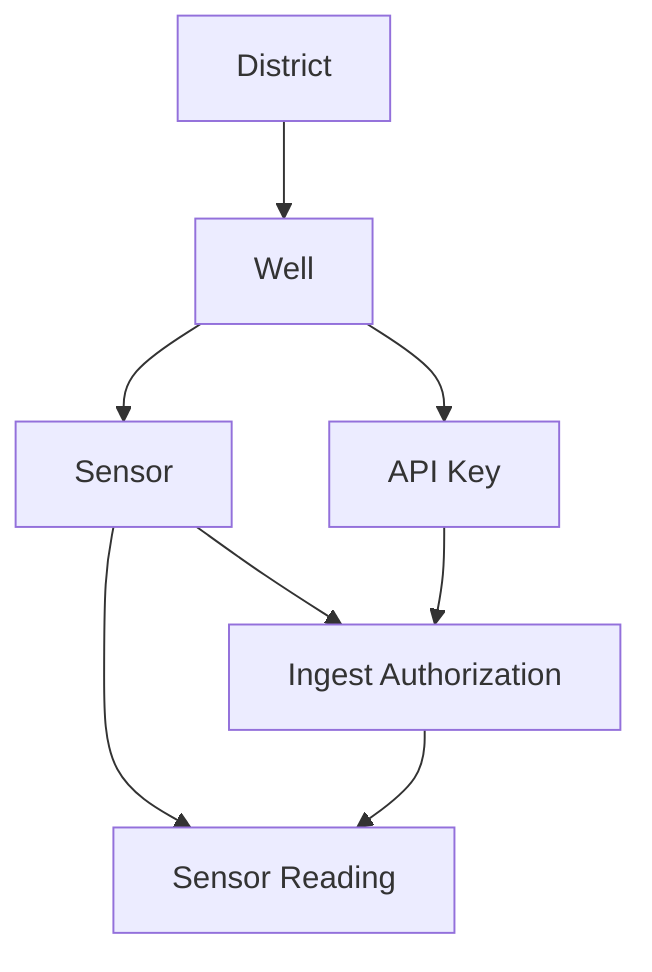
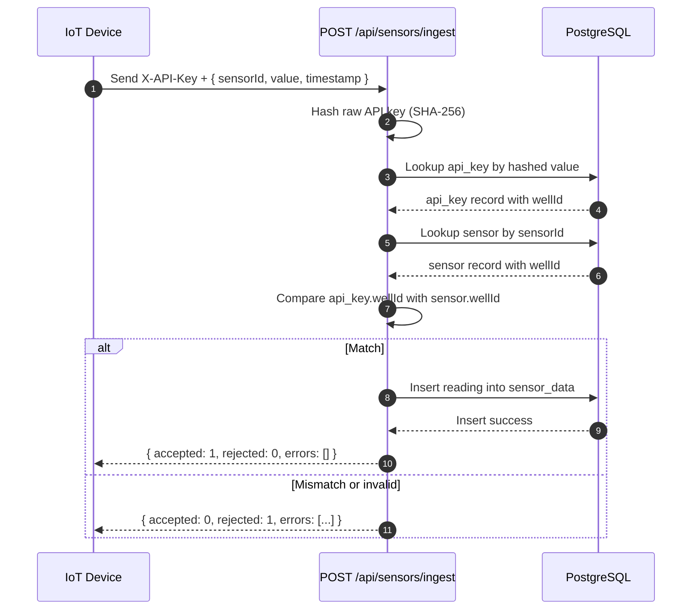

## Purpose

This document explains how sensor readings move through AqwaValley from device to database.
It is written for juniors and cross-functional teams that need a clear and shared model.

## Scope

This guide focuses on:

- API key authentication for ingest
- Sensor to well authorization checks
- Meaning of accepted, rejected, and errors
- Where district_id is and is not used in this cycle

## Core Components

| Component         | Responsibility                                         |
| ----------------- | ------------------------------------------------------ |
| IoT Device        | Sends reading payloads with sensorId, value, timestamp |
| Ingest Endpoint   | Receives requests at POST /api/sensors/ingest          |
| API Key Store     | Holds hashed keys and the well each key is scoped to   |
| Sensors Table     | Maps each sensorId to exactly one wellId               |
| Sensor Data Table | Stores validated readings                              |

## Data Model Relationships



Important relationship:

- API key is scoped to one well.
- Sensor is also scoped to one well.
- Ingest is accepted only when both resolve to the same well.

## End-to-End Ingest Cycle



## Request Contract

### Headers

- X-API-Key: raw key provided to the device

### Body

```json
{
  "sensorId": "uuid",
  "value": 12.7,
  "timestamp": "2026-03-17T10:00:00Z"
}
```

## Response Contract

### Success Example

```json
{
  "accepted": 1,
  "rejected": 0,
  "errors": []
}
```

### Rejection Example

```json
{
  "accepted": 0,
  "rejected": 1,
  "errors": [
    {
      "sensorId": "f19a01e0-9b08-4d50-8d19-e9fba52be98c",
      "reason": "Sensor does not belong to the authorized well"
    }
  ]
}
```

## Metrics Endpoint Error Contract

Endpoint: GET /api/wells/:id/metrics

The endpoint now returns structured errors for frontend-safe handling:

```json
{
  "error": {
    "code": "INVALID_WELL_ID",
    "message": "Well id must be a UUID",
    "details": {
      "fieldErrors": {
        "id": ["Invalid uuid"]
      }
    }
  }
}
```

Standard codes:

- UNAUTHORIZED: Missing or invalid session cookie.
- INVALID_WELL_ID: Path parameter is not a UUID.
- INVALID_QUERY_PARAMETERS: range, bucket, or format is invalid.
- WELL_NOT_FOUND: UUID is valid but no well exists.
- INTERNAL_ERROR: Unexpected server-side failure.

Frontend mapping guideline:

- 401 + UNAUTHORIZED: Show login/session-expired UI.
- 400 + INVALID_WELL_ID: Show developer-input error.
- 400 + INVALID_QUERY_PARAMETERS: Show filter validation feedback.
- 404 + WELL_NOT_FOUND: Show friendly not-found state.
- 500 + INTERNAL_ERROR: Show retry and support fallback.

## What Accepted and Rejected Mean

- accepted: number of readings successfully stored.
- rejected: number of readings refused by validation.
- errors: detailed reasons for each rejection.

Typical rejection causes:

- Invalid API key.
- Sensor not found.
- Sensor belongs to a different well than the API key scope.
- Invalid payload shape or timestamp format.

## Why API Keys Are Hashed

Raw API keys are secrets. The system hashes incoming keys before lookup so plaintext keys are not stored in the database.

Benefits:

- Reduces risk if database records are exposed.
- Keeps key verification deterministic.
- Supports standard secret-handling practices.

## Is district_id Part of Ingest Authentication

Short answer: no, not directly.

Direct checks for ingest authentication are only:

- API key hash lookup.
- Sensor lookup by sensorId.
- Well match between key scope and sensor ownership.

Where district_id matters:

- Dashboard filtering and reporting.
- District-level analytics.
- Operational governance and access policies.
- Seed organization and data grouping.

## Operational Notes for Teams

- A device must send the API key scoped to the well of its sensor.
- If seed data is regenerated, demo keys may change.
- Keep raw keys out of logs and tickets.
- Use inspection scripts or admin tooling to map key to authorized sensors.

## Quick Troubleshooting

1. If response says invalid key:
   - Confirm key is current and copied without extra whitespace.
   - Confirm key exists and is active.
2. If response says sensor not found:
   - Confirm sensorId is correct UUID from the database.
3. If response says sensor does not belong to authorized well:
   - Confirm sensor and API key map to the same well.
4. If ingestion succeeds but dashboard looks stale:
   - Verify time range filters and timestamp timezone.

## One-Line Mental Model

Ingest accepts a reading only when the provided API key and sensorId both resolve to the same well, then stores the reading.
